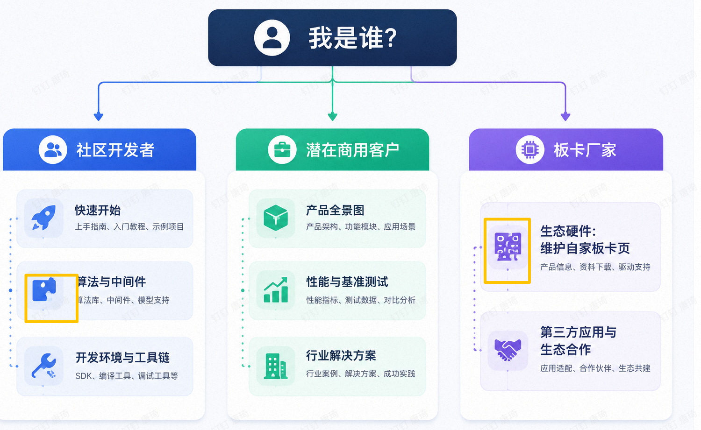

# 文档导航图

根据你的身份，选择最适合的阅读路径。

## 按章节速查

| 你想做什么 | 去哪一章 |
| --- | --- |
| 了解芯片规格和第一次拿到开发板 | [1. 概览](index.md) |
| 了解芯片AI的性能 | [2. 性能与基准测试](../02_benchmark/index.md) |
| 第一次拿到板子点亮并跑通NPU示例 | [3. 快速上手](../03_hardware/index.md) |
| 官方开发板基础使用说明 | [4. 开发板使用入门](../04_hardware/index.md) |
| 官方SDK及NPU工具链基础使用说明 | [5. SDK使用入门](../05_software/index.md) |
| 图像、音频、AI、中间件软件示例 | [6. 模块示例](../06_solutions/index.md) |
| 找行业落地方案 | [7. 行业解决方案](../07_solutions/index.md) |
| 第三方硬件板卡 | [8. 生态硬件板卡](../08_hardware/index.md) |
| 第三方解决方案 | [9. 生态解决方案](../09_thirdparty/index.md) |
| 加群 / 提 PR / 看更新 | [10. 社区与支持](../10_community/index.md) |
