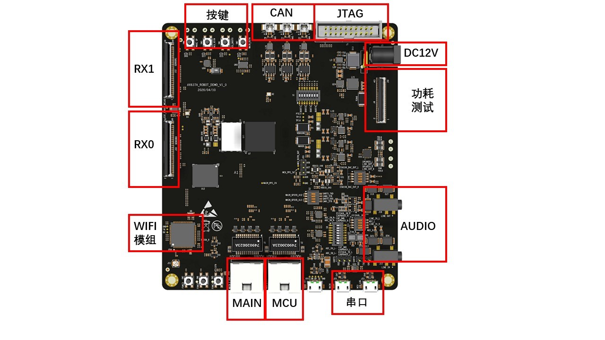
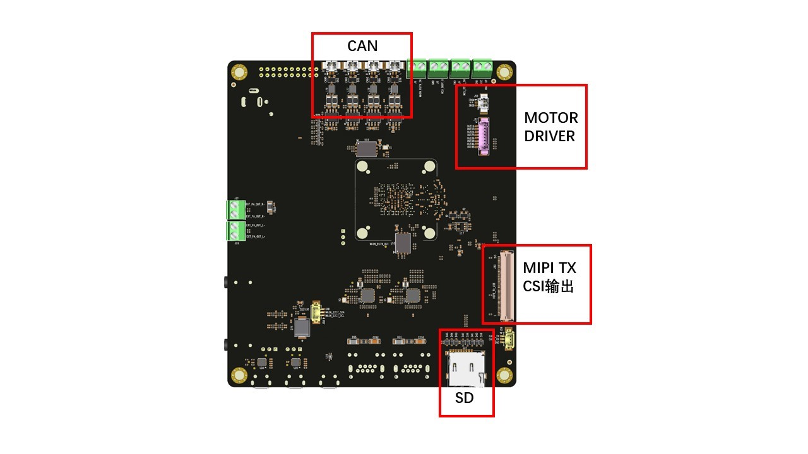
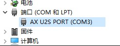
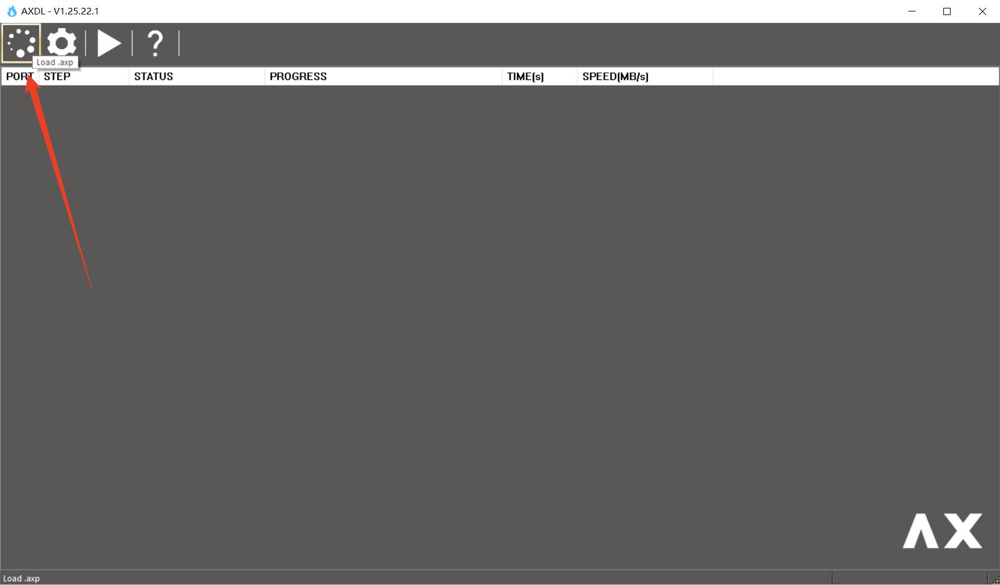
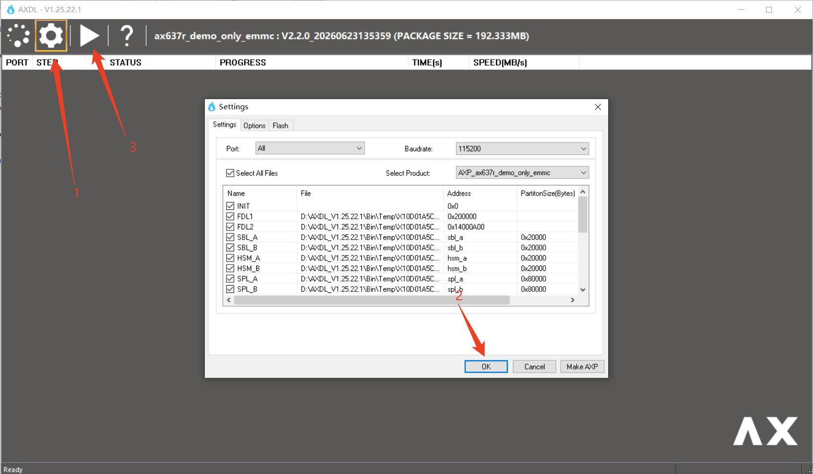
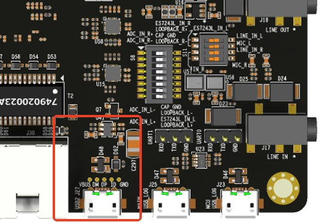
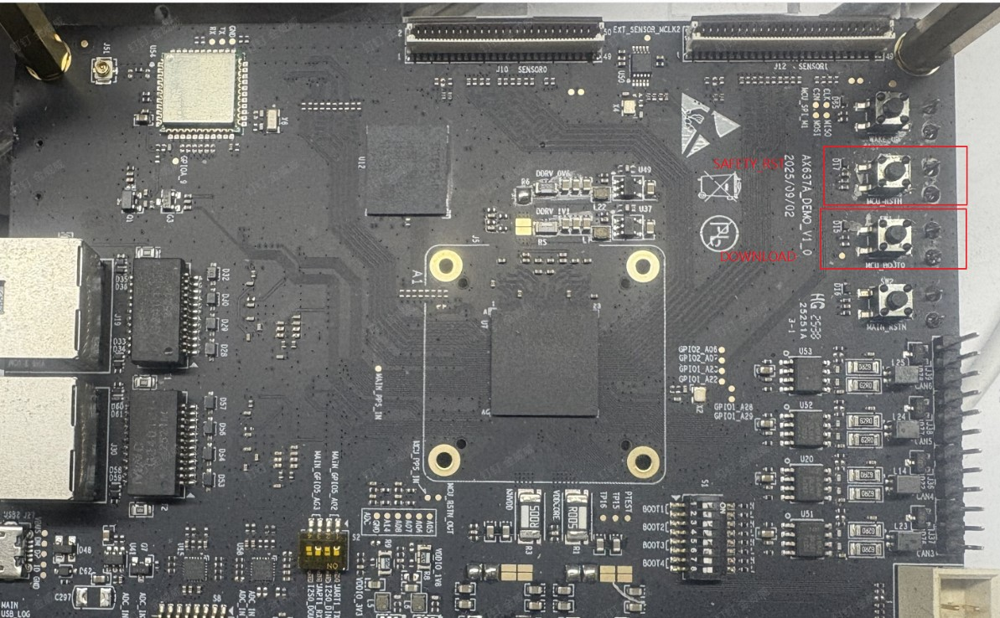
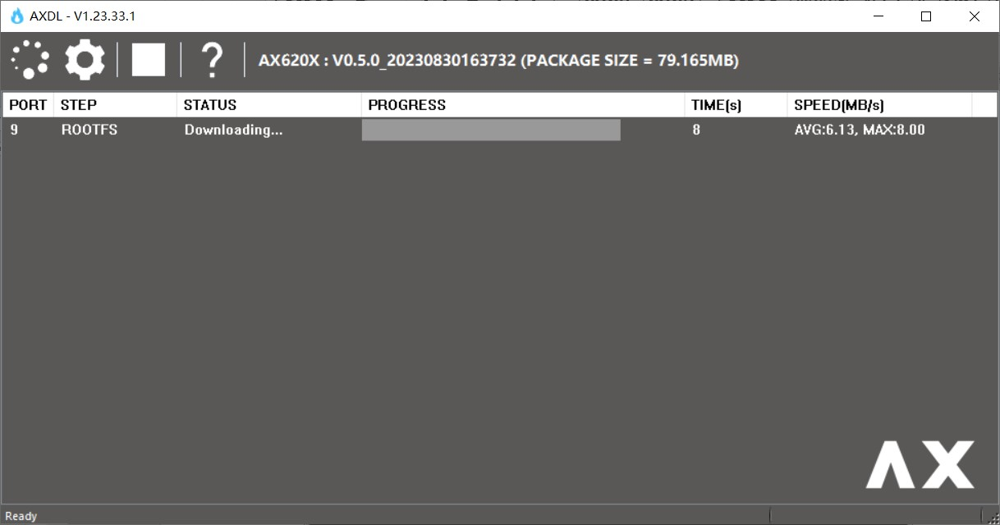
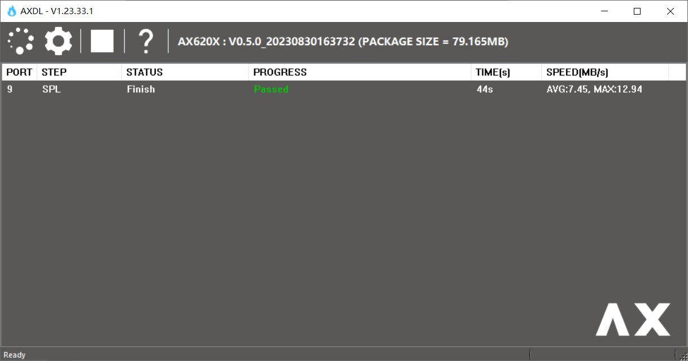

# AX637 DEMO Board

本章适用于 AX637（AX8910） 机器人开发板

AX637A ROBOT DEMO板集成了AX637A基本所有的功能模块，并且为Sensor模组预留了扩展接口，可用于AX637A芯片应用场景的功能验证。

## 一、接口说明

正面接口：

背面接口：

## 二、驱动安装

驱动安装包路径位于SDK发布包tools\\pc\_tools\\Driver\_V1.20.46.1.7z。

### 步骤1

移除PC连接的USB线。

### 步骤2

使用管理员权限，双击DriversForWin10\\DriverSetup.exe按照提示进行安装。

### 步骤3

连接USB线，Windows会自动安装USB驱动。
安装完成之后，Windows设备管理器显示如下：

## 三、固件烧录

### 步骤1

双击AXDL.exe运行工具，工具栏单击axp加载按钮，选择.axp镜像包文件：

### 步骤2

工具栏单击“设置” 按钮，在“Settings”页面AXDL将axp镜像包的镜像文件释放到本地Temp目录并自动进行配置，单击“OK”确认设置，然后在工具栏单击“开始” 按钮启动下载。

### 步骤3

将开发板的J27 USB2.0 Micro-B接口通过数据线连接到电脑：

在给开发板上电后同时按住下载（DOWNLOAD）和复位（SAFETY\_RST），随后松开复位（SAFETY\_RST），等几秒后，再松开下载（DOWNLOAD），之后工具上面会出现进度条。

进度条走完后显示“Passed”表示烧录成功

