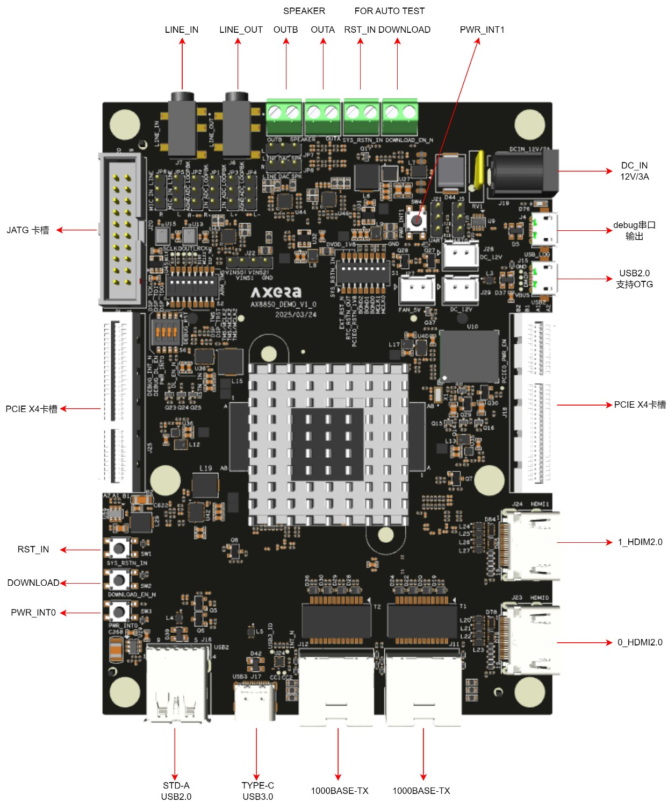
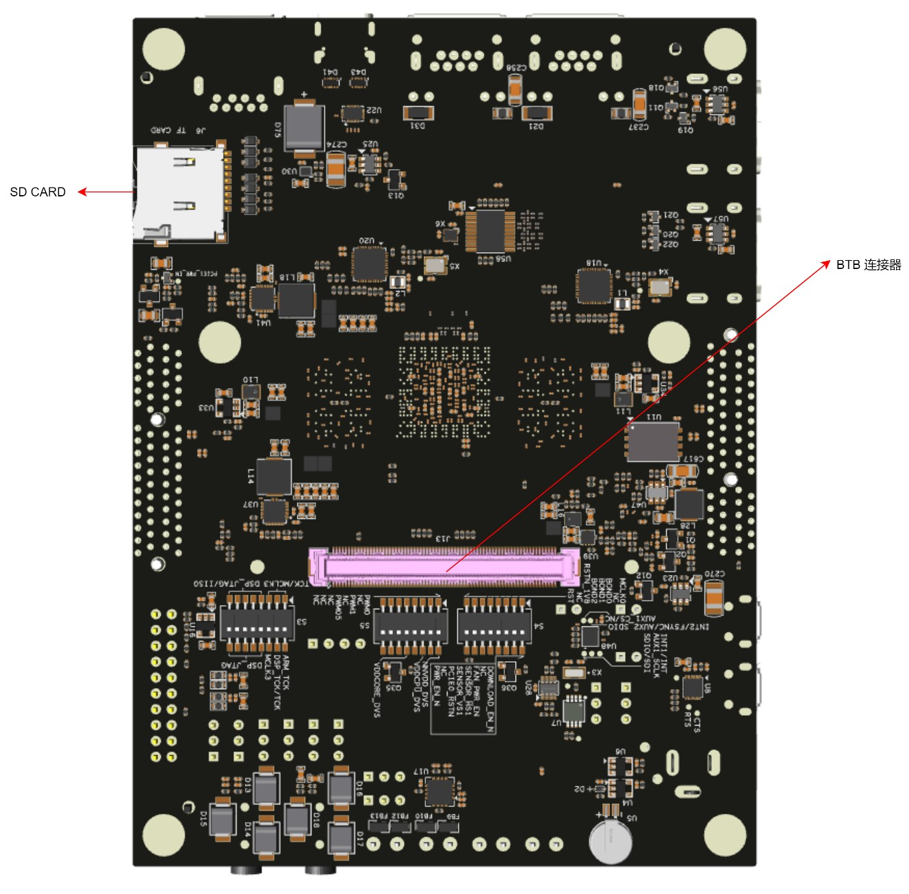
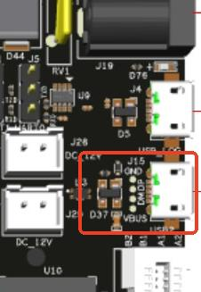

# AX650 DEMO Board

本章适用于 AX650N（AX8850N/AX8850）开发板

AX650N DEMO板集成了AX650N基本所有的功能模块，扩展板提供了sensor扩展接口，与主板的IO扩展接口连接使用，可用于多sensor应用场景的功能验证。

## 一、接口说明

正面接口：

背面接口：

## 二、驱动安装

驱动安装包路径位于SDK发布包tools\\pc\_tools\\Driver\_V1.20.46.1.7z。

### 步骤1

移除PC连接的USB线。

### 步骤2

使用管理员权限，双击DriversForWin10\\DriverSetup.exe按照提示进行安装。

### 步骤3

连接USB线，Windows会自动安装USB驱动。
安装完成之后，Windows设备管理器显示如下：

## 三、固件烧录

### 步骤1

双击AXDL.exe运行工具，工具栏单击axp加载按钮，选择.axp镜像包文件：

### 步骤2

工具栏单击“设置” 按钮，在“Settings”页面AXDL将axp镜像包的镜像文件释放到本地Temp目录并自动进行配置，单击“OK”确认设置，然后在工具栏单击“开始” 按钮启动下载。

### 步骤3

将开发板的J15 USB2.0 Micro-B接口通过数据线连接到电脑：

在给开发板上电后同时按住下载（DOWNLOAD）和复位（RSTN），随后松开复位（RSTN），等待工具下载完FDL后，再松开下载（DOWNLOAD）。

进度条走完后显示“Passed”表示烧录成功：

