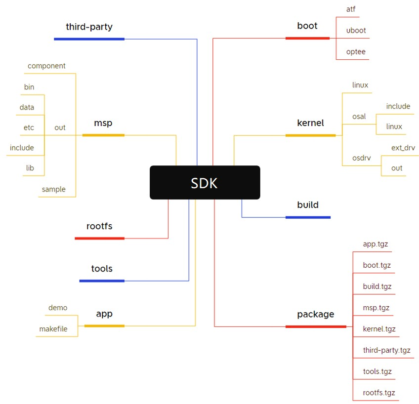
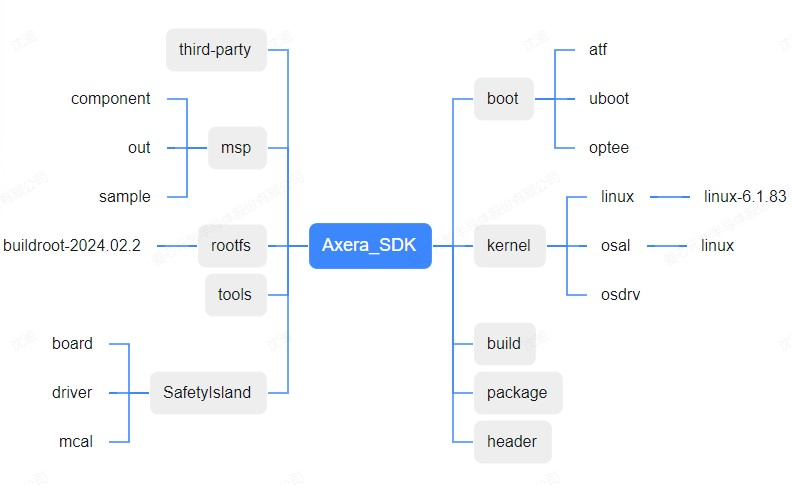
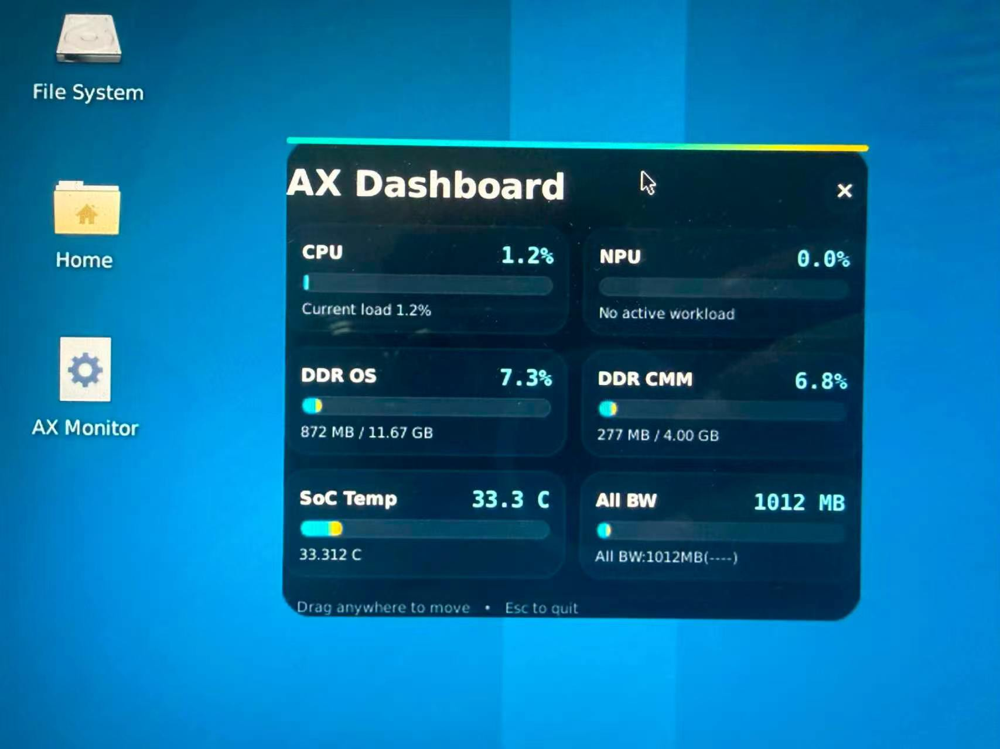

# 基础软件环境

- 本页包含SDK获取途径、系统相关、NPU 基础操作。不同芯片、开发板、模组和算力卡的固件、驱动和内存划分可能不同；
- 已验证内容会在表格中标注，未补齐的产品保留待补充位置。

## SDK获取方式

### 社区版本

- [AX8850](https://modelscope.cn/models/AXERA-TECH/AX650-Community-Hub/tree/master/sdk)
- AX8910(待完善)

### 商用版本

- 正式商务对接的客户，建议找对应的 FAE 获取最新的 SDK 版本更佳。

## AX8850 SDK使用说明

### 环境配置

示例环境：ubuntu-22.04.1-amd64
在如下步骤之前先将默认的shell切换到bash：

```bash
sudo dpkg-reconfigure dash
```

选择“No”，然后使用 `ls -l /bin/sh`确认切换结果：

```bash
axera@hbussrv0p:~$ ls -l /bin/sh
lrwxrwxrwx 1 root root 4 Feb 27 13:44 /bin/sh -> bash
```

#### 安装依赖

使用如下命令安装依赖包：

```bash
sudo apt update && sudo apt install -y make libc6:i386 lib32stdc++6 zlib1g-dev \
libncurses5-dev ncurses-term libncursesw5-dev g++ u-boot-tools texinfo texlive \
gawk libssl-dev openssl bc bison flex gcc gdb build-essential lib32z1 wget\ 
device-tree-compiler
```

使用如下命令安装python依赖：

````bash
sudo python3 -m pip install --upgrade pip
sudo pip3 install lxml
````

#### 安装交叉编译工具链

##### 安装ARM工具链：

运行以下命令后输入密码切换到root用户：

````bash
sudo su
````

创建安装路径并进入创建的路径：

````bash
mkdir /usr/local/ARM-toolchain
cd /usr/local/ARM-toolchain
````

下载工具链：

````bash
wget https://developer.arm.com/-/media/Files/downloads/gnu-a/9.2-2019.12/binrel/gcc-arm-9.2-2019.12-x86_64-aarch64-none-linux-gnu.tar.xz
````

解压工具链到当前路径：

````bash
tar -vxf gcc-arm-9.2-2019.12-x86_64-aarch64-none-linux-gnu.tar.xz
rm gcc-arm-9.2-2019.12-x86_64-aarch64-none-linux-gnu.tar.xz
````

添加环境变量：

````bash
echo "export PATH=\"/usr/local/ARM-toolchain/gcc-arm-9.2-2019.12-x86_64-aarch64-none-linux-gnu/bin:\$PATH\"" >> /etc/profile
source /etc/profile
````

然后执行 `aarch64-none-linux-gnu-gcc -v`命令，将返回如下版本号：

````bash
axera@hbussrv0p:~# aarch64-none-linux-gnu-gcc -v
Using built-in specs.
COLLECT_GCC=aarch64-none-linux-gnu-gcc
COLLECT_LTO_WRAPPER=/usr/local/gcc-arm-9.2-2019.12-x86_64-aarch64-none-linux-gnu/bin/../libexec/gcc/aarch64-none-linux-gnu/9.2.1/lto-wrapper
Target: aarch64-none-linux-gnu
Configured with: /tmp/dgboter/bbs/rhev-vm2--rhe6x86_64/buildbot/rhe6x86_64--aarch64-none-linux-gnu/build/src/gcc/configure --target=aarch64-none-linux-gnu --prefix= --with-sysroot=/aarch64-none-linux-gnu/libc --with-build-sysroot=/tmp/dgboter/bbs/rhev-vm2--rhe6x86_64/buildbot/rhe6x86_64--aarch64-none-linux-gnu/build/build-aarch64-none-linux-gnu/install//aarch64-none-linux-gnu/libc --with-bugurl=https://bugs.linaro.org/ --enable-gnu-indirect-function --enable-shared --disable-libssp --disable-libmudflap --enable-checking=release --enable-languages=c,c++,fortran --with-gmp=/tmp/dgboter/bbs/rhev-vm2--rhe6x86_64/buildbot/rhe6x86_64--aarch64-none-linux-gnu/build/build-aarch64-none-linux-gnu/host-tools --with-mpfr=/tmp/dgboter/bbs/rhev-vm2--rhe6x86_64/buildbot/rhe6x86_64--aarch64-none-linux-gnu/build/build-aarch64-none-linux-gnu/host-tools --with-mpc=/tmp/dgboter/bbs/rhev-vm2--rhe6x86_64/buildbot/rhe6x86_64--aarch64-none-linux-gnu/build/build-aarch64-none-linux-gnu/host-tools --with-isl=/tmp/dgboter/bbs/rhev-vm2--rhe6x86_64/buildbot/rhe6x86_64--aarch64-none-linux-gnu/build/build-aarch64-none-linux-gnu/host-tools --enable-fix-cortex-a53-843419 --with-pkgversion='GNU Toolchain for the A-profile Architecture 9.2-2019.12 (arm-9.10)'
Thread model: posix
gcc version 9.2.1 20191025 (GNU Toolchain for the A-profile Architecture 9.2-2019.12 (arm-9.10))
````

##### 安装RISCV工具链：

###### 获取方式：

- [社区版本](https://modelscope.cn/models/AXERA-TECH/AX650-Community-Hub/tree/master/sdk/edge-computing-AX650_SDK_V3.10.2/04.%20RiscvBuildToolChain/RISC-V_ToolChain)
- 商用版本请联系对接的FAE获取

在root用户下创建安装路径：

````bash
mkdir /usr/local/riscv-toolchain
````

解压工具链到对应路径：

````bash
tar -vxf riscv64-elf-gnu-amd64.tar.gz -C /usr/local/riscv-toolchain
````

添加环境变量：

````bash
echo "export PATH=\"/usr/local/riscv-toolchain/riscv64-elf-gnu-amd64/bin:\$PATH\"" >> /etc/profile
source /etc/profile
````

然后执行 `riscv64-unknown-linux-gnu-gcc -v`命令，将返回如下版本号：

````bash
axera@hbussrv0p:~# riscv64-unknown-elf-gcc -v
Using built-in specs.
COLLECT_GCC=riscv64-unknown-elf-gcc
COLLECT_LTO_WRAPPER=/usr/local/riscv64-elf-gnu-amd64/bin/../libexec/gcc/riscv64-unknown-elf/10.2.0/lto-wrapper
Target: riscv64-unknown-elf
Configured with: /ldhome/software/toolsbuild/slave2/workspace/Toolchain/release-riscv-0/build/../source/riscv/riscv-gcc/configure --target=riscv64-unknown-elf --with-gmp=/ldhome/software/toolsbuild/slave2/workspace/Toolchain/release-riscv-0/lib-for-gcc-x86_64-linux/ --with-mpfr=/ldhome/software/toolsbuild/slave2/workspace/Toolchain/release-riscv-0/lib-for-gcc-x86_64-linux/ --with-mpc=/ldhome/software/toolsbuild/slave2/workspace/Toolchain/release-riscv-0/lib-for-gcc-x86_64-linux/ --with-libexpat-prefix=/ldhome/software/toolsbuild/slave2/workspace/Toolchain/release-riscv-0/lib-for-gcc-x86_64-linux/ --with-pkgversion='T-HEAD RISCV Tools V2.0.1 B20210512' --enable-libgcctf --prefix=/ldhome/software/toolsbuild/slave2/workspace/Toolchain/release-riscv-0/install --disable-shared --disable-threads --enable-languages=c,c++ --with-system-zlib --enable-tls --with-newlib --with-sysroot=/ldhome/software/toolsbuild/slave2/workspace/Toolchain/release-riscv-0/install/riscv64-unknown-elf --with-native-system-header-dir=/include --disable-libmudflap --disable-libssp --disable-libquadmath --disable-libgomp --disable-nls --disable-tm-clone-registry --src=../../source/riscv/riscv-gcc --enable-multilib --with-abi=lp64d --with-arch=rv64gcxthead 'CFLAGS_FOR_TARGET=-Os   -mcmodel=medany' 'CXXFLAGS_FOR_TARGET=-Os   -mcmodel=medany'
Thread model: single
Supported LTO compression algorithms: zlib
gcc version 10.2.0 (T-HEAD RISCV Tools V2.0.1 B20210512)
````

### 安装SDK

切换到root用户并进入到SDK所在目录执行解包命令：

````bash
tar -xvf AX650_SDK_Vx.x.x.tgz
````

解压后，得到AX650\_SDK\_Vx.x.x目录，进入目录，执行 `./sdk_unpack.sh`展开SDK包中的内容，脚本会自动拉取Kernel源码，展开后的内容如下所示：


### 编译版本

进入*安装目录*/AX650\_SDK\_Vx.x.x/build目录下执行如下命令实现编译和打包：

````bash
make p=AX650_emmc clean all install axp
````

编译成功后，将在build/out目录下生成AX650\_emmc目录和AX650\_emmc\_VX.X.X\_xxxxxxxxxx.axp，若需同时打包ubuntu版本的axp，可修改build/projects/AX650\_emmc.mak，将use\_ubuntu\_rootfs := yes的注释打开，编译后在out目录中还会生成两个axp包，AX650\_emmc\_ubuntu\_rootfs\_VX.X.X\_xxxxxxxxxx.axp、AX650\_emmc\_ubuntu\_rootfs\_desktop\_VX.X.X\_xxxxxxxxxx.axp，分别是ubuntu base版本和ubuntu desktop版本。
请参考[官方demo板使用说明](../04_hardware/ax650_board)烧录axp文件。

## AX8910 SDK使用说明

### 环境配置

示例环境：ubuntu-22.04.1-amd64
在如下步骤之前先将默认的shell切换到bash：

```bash
sudo dpkg-reconfigure dash
```

选择“No”，然后使用 `ls -l /bin/sh`确认切换结果：

```bash
axera@hbussrv0p:~$ ls -l /bin/sh
lrwxrwxrwx 1 root root 4 Feb 27 13:44 /bin/sh -> bash
```

#### 安装依赖

使用如下命令安装依赖包：

```bash
sudo apt update && sudo apt install -y make libc6:i386 lib32stdc++6 zlib1g-dev \
libncurses5-dev ncurses-term libncursesw5-dev g++ u-boot-tools texinfo texlive \
gawk libssl-dev openssl bc bison flex gcc gdb build-essential lib32z1 wget\ 
device-tree-compiler python3-pyelftools
```

使用如下命令安装python依赖：

````bash
sudo python3 -m pip install --upgrade pip
sudo python3 -m pip install openpyxl
sudo pip3 install lxml
sudo pip3 install lz4
sudo pip3 install pycryptodome
sudo pip3 install rsa
sudo pip3 install sympy
````

#### 安装交叉编译工具链

##### 安装AARCH64工具链：

运行以下命令后输入密码切换到root用户：

````bash
sudo su
````

下载工具链：

````bash
wget https://developer.arm.com/-/media/files/downloads/gnu-a/9.2-2019.12/binrel/gcc-arm-9.2-2019.12-x86_64-aarch64-none-linux-gnu.tar.xz
````

解压工具链到/usr/local/：

````bash
tar -vxf gcc-arm-9.2-2019.12-x86_64-aarch64-none-linux-gnu.tar.xz -C /usr/local/
````

添加环境变量：

````bash
echo "export PATH=\"/usr/local/gcc-arm-9.2-2019.12-x86_64-aarch64-none-linux-gnu/bin:\$PATH\"" >> /etc/profile
source /etc/profile
````

然后执行 `aarch64-none-linux-gnu-gcc -v`命令，将返回如下版本号：

````bash
axera@hbussrv0p:~# aarch64-none-linux-gnu-gcc -v
Using built-in specs.
COLLECT_GCC=aarch64-none-linux-gnu-gcc
COLLECT_LTO_WRAPPER=/usr/local/gcc-arm-9.2-2019.12-x86_64-aarch64-none-linux-gnu/bin/../libexec/gcc/aarch64-none-linux-gnu/9.2.1/lto-wrapper
Target: aarch64-none-linux-gnu
Configured with: /tmp/dgboter/bbs/rhev-vm2--rhe6x86_64/buildbot/rhe6x86_64--aarch64-none-linux-gnu/build/src/gcc/configure --target=aarch64-none-linux-gnu --prefix= --with-sysroot=/aarch64-none-linux-gnu/libc --with-build-sysroot=/tmp/dgboter/bbs/rhev-vm2--rhe6x86_64/buildbot/rhe6x86_64--aarch64-none-linux-gnu/build/build-aarch64-none-linux-gnu/install//aarch64-none-linux-gnu/libc --with-bugurl=https://bugs.linaro.org/ --enable-gnu-indirect-function --enable-shared --disable-libssp --disable-libmudflap --enable-checking=release --enable-languages=c,c++,fortran --with-gmp=/tmp/dgboter/bbs/rhev-vm2--rhe6x86_64/buildbot/rhe6x86_64--aarch64-none-linux-gnu/build/build-aarch64-none-linux-gnu/host-tools --with-mpfr=/tmp/dgboter/bbs/rhev-vm2--rhe6x86_64/buildbot/rhe6x86_64--aarch64-none-linux-gnu/build/build-aarch64-none-linux-gnu/host-tools --with-mpc=/tmp/dgboter/bbs/rhev-vm2--rhe6x86_64/buildbot/rhe6x86_64--aarch64-none-linux-gnu/build/build-aarch64-none-linux-gnu/host-tools --with-isl=/tmp/dgboter/bbs/rhev-vm2--rhe6x86_64/buildbot/rhe6x86_64--aarch64-none-linux-gnu/build/build-aarch64-none-linux-gnu/host-tools --enable-fix-cortex-a53-843419 --with-pkgversion='GNU Toolchain for the A-profile Architecture 9.2-2019.12 (arm-9.10)'
Thread model: posix
gcc version 9.2.1 20191025 (GNU Toolchain for the A-profile Architecture 9.2-2019.12 (arm-9.10))
````

##### 安装ARM32工具链：

下载工具链：

````bash
wget https://developer.arm.com/-/cdn-downloads/permalink/legacy-linaro-gnu-toolchains/7.5-2019.12/gcc-linaro-7.5.0-2019.12-x86_64_arm-linux-gnueabi.tar.xz
````

在root用户下解压工具链到/usr/local/：

````bash
tar -vxf gcc-linaro-7.5.0-2019.12-x86_64_arm-linux-gnueabi.tar.xz -C /usr/local/
````

添加环境变量：

````bash
echo "export PATH=\"/usr/local/gcc-linaro-7.5.0-2019.12-x86_64_arm-linux-gnueabi/bin:\$PATH\"" >> /etc/profile
source /etc/profile
````

然后执行 `arm-linux-gnueabi-gcc -v`命令，将返回如下版本号：

````bash
axera@hbussrv0p:~# arm-linux-gnueabi-gcc -v
Using built-in specs.
COLLECT_GCC=arm-linux-gnueabi-gcc
COLLECT_LTO_WRAPPER=/usr/local/gcc-linaro-7.5.0-2019.12-x86_64_arm-linux-gnueabi/bin/../libexec/gcc/arm-linux-gnueabi/7.5.0/lto-wrapper
Target: arm-linux-gnueabi
Configured with: '/home/tcwg-buildslave/workspace/tcwg-make-release_0/snapshots/gcc.git~linaro-7.5-2019.12/configure' SHELL=/bin/bash --with-mpc=/home/tcwg-buildslave/workspace/tcwg-make-release_0/_build/builds/destdir/x86_64-unknown-linux-gnu --with-mpfr=/home/tcwg-buildslave/workspace/tcwg-make-release_0/_build/builds/destdir/x86_64-unknown-linux-gnu --with-gmp=/home/tcwg-buildslave/workspace/tcwg-make-release_0/_build/builds/destdir/x86_64-unknown-linux-gnu --with-gnu-as --with-gnu-ld --disable-libmudflap --enable-lto --enable-shared --without-included-gettext --enable-nls --with-system-zlib --disable-sjlj-exceptions --enable-gnu-unique-object --enable-linker-build-id --disable-libstdcxx-pch --enable-c99 --enable-clocale=gnu --enable-libstdcxx-debug --enable-long-long --with-cloog=no --with-ppl=no --with-isl=no --disable-multilib --with-float=soft --with-mode=thumb --with-tune=cortex-a9 --with-arch=armv7-a --enable-threads=posix --enable-multiarch --enable-libstdcxx-time=yes --enable-gnu-indirect-function --with-build-sysroot=/home/tcwg-buildslave/workspace/tcwg-make-release_0/_build/sysroots/arm-linux-gnueabi --with-sysroot=/home/tcwg-buildslave/workspace/tcwg-make-release_0/_build/builds/destdir/x86_64-unknown-linux-gnu/arm-linux-gnueabi/libc --enable-checking=release --disable-bootstrap --enable-languages=c,c++,fortran,lto --build=x86_64-unknown-linux-gnu --host=x86_64-unknown-linux-gnu --target=arm-linux-gnueabi --prefix=/home/tcwg-buildslave/workspace/tcwg-make-release_0/_build/builds/destdir/x86_64-unknown-linux-gnu
Thread model: posix
gcc version 7.5.0 (Linaro GCC 7.5-2019.12)
````

##### 安装MCU工具链：

下载工具链：

````bash
wget https://developer.arm.com/-/media/Files/downloads/gnu-rm/5_4-2016q3/gcc-arm-none-eabi-5_4-2016q3-20160926-linux.tar.bz2
````

在root用户下解压工具链到/usr/local/：

````bash
tar -jxf gcc-arm-none-eabi-5_4-2016q3-20160926-linux.tar.bz2 -C /usr/local/
````

添加环境变量：

````bash
echo "export PATH=\"/usr/local/gcc-arm-none-eabi-5_4-2016q3/bin:\$PATH\"" >> /etc/profile
source /etc/profile
````

然后执行 `arm-none-eabi-gcc -v`命令，将返回如下版本号：

````bash
axera@hbussrv0p:~# arm-none-eabi-gcc -v
Using built-in specs.
COLLECT_GCC=arm-none-eabi-gcc
COLLECT_LTO_WRAPPER=/usr/local/gcc-arm-none-eabi-5_4-2016q3/bin/../lib/gcc/arm-none-eabi/5.4.1/lto-wrapper
Target: arm-none-eabi
Configured with: /home/build/work/GCC-5-build/src/gcc/configure --target=arm-none-eabi --prefix=/home/build/work/GCC-5-build/install-native --libexecdir=/home/build/work/GCC-5-build/install-native/lib --infodir=/home/build/work/GCC-5-build/install-native/share/doc/gcc-arm-none-eabi/info --mandir=/home/build/work/GCC-5-build/install-native/share/doc/gcc-arm-none-eabi/man --htmldir=/home/build/work/GCC-5-build/install-native/share/doc/gcc-arm-none-eabi/html --pdfdir=/home/build/work/GCC-5-build/install-native/share/doc/gcc-arm-none-eabi/pdf --enable-languages=c,c++ --enable-plugins --disable-decimal-float --disable-libffi --disable-libgomp --disable-libmudflap --disable-libquadmath --disable-libssp --disable-libstdcxx-pch --disable-nls --disable-shared --disable-threads --disable-tls --with-gnu-as --with-gnu-ld --with-newlib --with-headers=yes --with-python-dir=share/gcc-arm-none-eabi --with-sysroot=/home/build/work/GCC-5-build/install-native/arm-none-eabi --build=i686-linux-gnu --host=i686-linux-gnu --with-gmp=/home/build/work/GCC-5-build/build-native/host-libs/usr --with-mpfr=/home/build/work/GCC-5-build/build-native/host-libs/usr --with-mpc=/home/build/work/GCC-5-build/build-native/host-libs/usr --with-isl=/home/build/work/GCC-5-build/build-native/host-libs/usr --with-cloog=/home/build/work/GCC-5-build/build-native/host-libs/usr --with-libelf=/home/build/work/GCC-5-build/build-native/host-libs/usr --with-host-libstdcxx='-static-libgcc -Wl,-Bstatic,-lstdc++,-Bdynamic -lm' --with-pkgversion='GNU Tools for ARM Embedded Processors' --with-multilib-list=armv6-m,armv7-m,armv7e-m,armv7-r,armv8-m.base,armv8-m.main
Thread model: single
gcc version 5.4.1 20160919 (release) [ARM/embedded-5-branch revision 240496] (GNU Tools for ARM Embedded Processors)
````

### 安装SDK

切换到root用户并进入到SDK所在目录执行解包命令：

````bash
tar -xvf AX637_SDK_Vx.x.x.tgz
````

解压后，得到AX637\_SDK\_Vx.x.x目录，进入目录，执行 `./sdk_unpack.sh`展开SDK包中的内容，脚本会自动拉取Kernel源码，展开后的内容如下所示：


### 编译版本

进入*安装目录*/AX637\_SDK\_Vx.x.x/build目录下执行如下命令实现编译和打包：

````bash
make p=AX650_emmc clean all install axp
````

编译成功后，将在build/out目录下生成AX650\_emmc目录和axera_ax637r_demo_only_emmc_Vx.x.x_xxxxxxxxxxxx.axp。
请参考[官方demo板使用说明](../04_hardware/ax637_board)烧录axp文件。

## 系统相关

### 版本查询

固件版本指烧写到设备上的系统镜像或 AXP 版本。不同产品的版本查询命令可能不同，当前已验证命令如下：

| 产品 / 形态                       | 查询命令                      | 当前状态          |
| --------------------------------- | ----------------------------- | ----------------- |
| AX8850N / AX8910  主控开发板      | `cat /proc/ax_proc/version` | 已验证            |
| AX8850 / AX8850N 算力卡           | `axcl-smi`                  | 已验证            |


AX8850 / AX8850N 主控开发板示例：

```bash
root@ax650:~# cat /proc/ax_proc/version
Ax_Version V3.6.2_20250731140456
root@ax650:~#
```

AX8910 主控开发板示例：

```bash
//待补充
```

AX8850 / AX8850N 算力卡示例：

```bash
axera@raspberrypi:~ $ axcl-smi
+------------------------------------------------------------------------------------------------+
| AXCL-SMI  V3.6.4_20250822020158                                  Driver  V3.6.4_20250822020158 |
+-----------------------------------------+--------------+---------------------------------------+
| Card  Name                     Firmware | Bus-Id       |                          Memory-Usage |
| Fan   Temp                Pwr:Usage/Cap | CPU      NPU |                             CMM-Usage |
|=========================================+==============+=======================================|
|    0  AX650N                     V3.6.4 | 0001:01:00.0 |                158 MiB /      945 MiB |
|   --   52C                      -- / -- | 0%        0% |                 18 MiB /     7040 MiB |
+-----------------------------------------+--------------+---------------------------------------+

+------------------------------------------------------------------------------------------------+
| Processes:                                                                                     |
| Card      PID  Process Name                                                   NPU Memory Usage |
|================================================================================================|
axera@raspberrypi:~ $
```


### CMM 说明

CMM 用于划分系统内存与 NPU 可用内存。该项主要适用于主控开发板；算力卡通常以卡端 DDR 容量和 AXCL 运行环境为准。
如需运行大模型或多路并发任务，优先确认 CMM 或卡端 DDR 容量是否满足模型加载和推理需要。
使用如下命令查询CMM内存使用情况：

```bash
cat /proc/ax_proc/mem_cmm_info
```

使用如下命令查询OS内存使用情况：

```bash
free -m
```

AX8850N / AX8850N 主控开发板示例：

```bash
root@ax650:~# cat /proc/ax_proc/mem_cmm_info 
--------------------SDK VERSION-------------------
[Axera version]: ax_cmm V3.10.2 Jun  9 2026 16:56:30
+---PARTITION: Phys(0x1E0000000, 0x2FFFFFFFF), Size=4718592KB(4608MB),    NAME="anonymous"
 nBlock(Max=1330, Cur=1330, New=1330, Free=0)  nbytes(Max=1694826496B(1655104KB,1616MB), Cur=1694826496B(1655104KB,1616MB), New=1694826496B(1655104KB,1616MB), Free=0B(0KB,0MB))  Block(Max=168714240B(164760KB,160MB), Min=4096B(4KB,0MB), Avg=2837550B(2771KB,2MB)) 
   |-Block: phys(0x1E0000000, 0x1E05FFFFF), cache =non-cacheable, length=6144KB(6MB),    name="vdec_ko"
   |-Block: phys(0x1E0600000, 0x1E061BFFF), cache =non-cacheable, length=112KB(0MB),    name="VPP_DEV"
   |-Block: phys(0x1E0655000, 0x1E0655FFF), cache =non-cacheable, length=4KB(0MB),    name="TDP_CMODE3"
······
  |-Block: phys(0x245004000, 0x245004FFF), cache =non-cacheable, length=4KB(0MB),    name="npu"
   |-Block: phys(0x245005000, 0x24504FFFF), cache =cacheable, length=300KB(0MB),    name="npu"

---CMM_USE_INFO:
 total size=4718592KB(4608MB),used=1655104KB(1616MB + 320KB),remain=3063488KB(2991MB + 704KB),partition_number=1,block_number=1330
root@ax650:~# free -m
               total        used        free      shared  buff/cache   available
Mem:            3421        1256         878           1        1286        2086
Swap:              0           0           0
```

**从上可以看出CMM部分内存总大小为4608MB，OS部分内存总大小为3421MB，总内存大小为两者相加8029MB。**

### 频率查询

频率数据用于确认DDR/VENC/VDEC/NPU等部分的运行频率，频率会影响到性能表现，这里主要关注DDR频率。

| 产品 / 形态                       | 检查项         | 命令                        | 说明                            |
| --------------------------------- | -------------- | --------------------------- | ------------------------------- |
| AX8850N / AX8910 主控开发板      | DDR频率         | `ax_clk` | -               |已测试
| AX8850 / AX8850N 算力卡           | 不适用          | -                          | -                                |

AX8850 / AX8850N 主控开发板示例：

```bash
root@ax650:~# ax_clk 

Current Clk Freqs:
MOD             FREQ
-----------------------------------------------
DDR             4266
TDP             700000000
GDC             700000000
VPP             700000000
VGP             700000000
DPU0            624000000
DPU1            624000000
DPU_LITE        624000000
VENC            624000000
JENC            624000000
VDEC            624000000
JDEC            624000000
IFE             624000000
ITP             700000000
NPU             800000000
VDSP            800000000
ACLK_TOP_NN     1600000000
ACLK_TOP        800000000
ACLK_TOP1       800000000
ACLK_TOP2       800000000
ACLK_TOP3       800000000
-----------------------------------------------
```

AX8910 主控开发板示例：

```bash
//待补充
```

### 带宽查询

带宽数据用于确认 DDR / AXI / PCIE 等系统资源是否处于预期状态。不同产品的工具和测试点不同。

| 产品 / 形态                       | 检查项         | 命令                        | 说明                            |
| --------------------------------- | -------------- | --------------------------- | ------------------------------- |
| AX8850N / AX8910 主控开发板      | DDR / AXI 带宽 | `cat /proc/ax_proc/bw/bw` | 需要加载ax_perf_monitor.ko      |
| AX8850 / AX8850N 算力卡           | PCIE 带宽      | 待补充                      | 记录宿主机、PCIE 版本和链路宽度 |

加载ax_perf_monitor.ko时需要提供`freq`和`width`两个参数，只有提供了两个参数后，在ax_perf_monitor.ko中会计算总的实际带宽占理论带宽的百分比，否则不能显示总的带宽占理论带宽的百分比。其中`freq`是由`ax_clk`查询到的DDR频率，`width`由硬件设计决定，单片ddr width为32，两片ddr width为64。
驱动路径一般是`/soc/ko/ax_perf_monitor.ko`，驱动默认不会加载，需要手动加载，命令如下：

```bash
insmod /soc/ko/ax_perf_monitor.ko freq=<freq> width=<width>
```

AX8850 / AX8850N 主控开发板示例：

```bash
root@ax650:~# insmod /soc/ko/ax_perf_monitor.ko freq=4266 width=64
root@ax650:~# cat /proc/ax_proc/bw/bw
All BW:16176MB(47%)
cpu/common/debug BW:534642KB(3%), RD_BW: 411942KB(2%), WR_BW: 122699KB(0%)
isp/vdec BW:0KB(0%), RD_BW: 0KB(0%), WR_BW: 0KB(0%)
npu BW:15640444KB(96%), RD_BW: 15634235KB(96%), WR_BW: 6209KB(0%)
venc/flash BW:1294KB(0%), RD_BW: 0KB(0%), WR_BW: 1294KB(0%)
vdsp/mm/pipe BW:0KB(0%), RD_BW: 0KB(0%), WR_BW: 0KB(0%)
root@ax650:~#
```

AX8910 主控开发板示例：

```bash
//待补充
```

## NPU 基础操作

### 使用率查询

算力查询用于确认 NPU 设备是否被系统识别，以及当前可用的 NPU 资源。不同产品的查询方式不同：

| 产品 / 形态                       | 查询方式                      | 说明                                                                    |
| --------------------------------- | ----------------------------- | ----------------------------------------------------------------------- |
| AX8850N / AX8910主控开发板      | `cat /proc/ax_proc/npu/top` | 查询板端 NPU 使用率，需要先 使能：`echo 1 > /proc/ax_proc/npu/enable` |
| AX8850 / AX8850N 算力卡           | `axcl-smi`                  | 通过 AXCL 查询卡端 NPU 资源                                             |

AX8850N / AX8850N 主控开发板示例：

```bash
root@ax650:/# echo 1 > /proc/ax_proc/npu/enable 
root@ax650:/# cat /proc/ax_proc/npu/top
core:vnpu-Non
time:568387
period:1000000
utilization:96%
```

AX8910 主控开发板示例：

```bash
//待补充
```

AX8850 / AX8850N 算力卡示例：

```bash
axera@raspberrypi:~ $ axcl-smi 
+------------------------------------------------------------------------------------------------+
| AXCL-SMI  V3.6.4_20250822020158                                  Driver  V3.6.4_20250822020158 |
+-----------------------------------------+--------------+---------------------------------------+
| Card  Name                     Firmware | Bus-Id       |                          Memory-Usage |
| Fan   Temp                Pwr:Usage/Cap | CPU      NPU |                             CMM-Usage |
|=========================================+==============+=======================================|
|    0  AX650N                     V3.6.4 | 0001:01:00.0 |                193 MiB /      945 MiB |
|   --   57C                      -- / -- | 2%       97% |               1408 MiB /     7040 MiB |
+-----------------------------------------+--------------+---------------------------------------+

+------------------------------------------------------------------------------------------------+
| Processes:                                                                                     |
| Card      PID  Process Name                                                   NPU Memory Usage |
|================================================================================================|
|    0  2562244  /home/axera/miniforge3/bin/python3.12                                     0 KiB |
|    0  2714215  /usr/bin/axcl/axcl_run_model                                           7784 KiB |
+------------------------------------------------------------------------------------------------+
```

### 跑分工具使用

跑分用于确认模型、运行环境和驱动是否正常。当前只保留已确认工具，其余工具先占位，避免误导用户。

| 场景                             | 工具             | 用途                                 | 状态   |
| -------------------------------- | ---------------- | ------------------------------------ | ------ |
| 板上模型 latency 测试            | `ax_run_model` | 测试单个 `.axmodel` 的推理耗时     | 已确认 |
| CNN / Transformer 完整 Benchmark | 待补充           | 统计推理耗时、吞吐、功耗等           | 待补充 |
| LLM / VLM Benchmark              | 待补充           | 统计 Prefill、Decode、TTFT、显存占用 | 待补充 |
| 算力卡 Benchmark                 | 待补充           | 统计 AXCL 场景下的单卡 / 多卡性能    | 待补充 |

AX8850N / AX8850N 主控开发板上的 `ax_run_model` 使用示例：

```bash
root@ax650:~# ax_run_model -m ./yolo11s.axmodel -r 100 -w 10 
   Run AxModel:
         model: ./yolo11s.axmodel
          type: 3 Core
          vnpu: Disable
      affinity: 0b001
        warmup: 10
        repeat: 100
         batch: { auto: 0 }
      parallel: false
   pulsar2 ver: 3.2 99cf147d
    engine ver: 2.12.0s
      tool ver: 2.5.1a
      cmm size: 10488066 Bytes
  ---------------------------------------------------------------------------
  min =   3.169 ms   max =   3.180 ms   avg =   3.174 ms  median =   3.174 ms
   5% =   3.171 ms   90% =   3.178 ms   95% =   3.179 ms     99% =   3.180 ms
  ---------------------------------------------------------------------------
```

AX8910 主控开发板示例：

```bash
//待补充
```

**输出字段说明：**

- **Model Info**：显示模型路径、核心类型（如 3 Core）、NPU 模式、亲和性设置等运行配置；
- **Version Info**：显示 Pulsar2、Engine、Tool 版本及 CMM 占用大小；
- **Performance Metrics**：
  - `min` / `max` / `avg` / `median`：最小、最大、平均和延迟中位数；
  - `5%` / `90%` / `95%` / `99%`：不同百分位延迟，反映尾部延迟波动；

常用参数说明：

| 参数                    | 说明                                                                               |
| ----------------------- | ---------------------------------------------------------------------------------- |
| `-m, --model`         | 指定 `.axmodel` 模型文件路径（必填）                                             |
| `-r, --repeat`        | 模型重复运行次数，统计平均耗时（默认 `1`）                                       |
| `-w, --warmup`        | 正式统计前的预热次数（默认 `1`）                                                 |
| `-s, --sleep`         | 每次推理后休眠毫秒数（默认 `0`）                                                 |
| `-v, --vnpu`          | NPU 模式：`0=Disable`，`1=STD`，`2=BigLittle`，`3=LittleBig`（默认 `0`） |
| `-a, --affinity`      | NPU 亲和性 / 指定核心（默认 `1`）                                                |
| `-p, --parallel`      | 并行使用所有 NPU 核心（默认 `0`）                                                |
| `-b, --batch`         | 运行的 batch 索引（默认 `0`）                                                    |
| `-g, --group`         | 选择 shape 分组（默认 `0`）                                                      |
| `-i, --input-folder`  | 指定存放输入文件（`.bin`）的文件夹目录                                           |
| `-o, --output-folder` | 指定保存输出文件的目录                                                             |
| `--save-benchmark`    | 将 min / max / avg 结果保存为 JSON 文件                                            |
| `--verify`            | 运行模型后校验输出与参考是否一致                                                   |

执行结束后终端会输出上述 latency 统计结果。如果加上 `--save-benchmark` 会在当前目录生成一个 JSON 文件，便于后续汇总对比。

## AX Monitor Dashboard

[AX Monitor Dashboard](https://github.com/ivanshi1108/ax_dashboard)由[ivanshi1108](https://github.com/ivanshi1108) 开发，提供GUI和CLI两种形式，可实时监控系统资源使用状态，提供更直观的展示方式。
使用此工具需要加载ax_perf_monitor.ko并使能/proc/ax_proc/npu/enable，才可查看NPU使用率以及带宽占用情况。

### CLI形式

编译：

```bash
cd /root/ax_dashboard
g++ -std=c++17 -O2 -Wall -Wextra cpp/dashboard_cli.cpp -o cpp/dashboard_cli
```

运行：

````bash
cd /root/ax_dashboard
./cpp/dashboard_cli
````

AX8850 / AX8850N 主控开发板示例：

````bash
root@ax650:~/ax_dashboard# g++ -std=c++17 -O2 -Wall -Wextra cpp/dashboard_cli.cpp -o cpp/dashboard_cli
root@ax650:~/ax_dashboard# insmod /soc/ko/ax_perf_monitor.ko freq=4266 width=64
root@ax650:~/ax_dashboard# echo 1 > /proc/ax_proc/npu/enable
root@ax650:~/ax_dashboard# ./cpp/dashboard_cli
AX Dashboard CLI (C++)
Press Ctrl+C to quit

CPU       [##--------------------------] 7.3%      Current load 7.3%
DDR OS    [############----------------] 43.0%     1.44 GB / 3.34 GB
DDR CMM   [#######################-----] 82.1%     3.69 GB / 4.50 GB
NPU       [#####################-------] 74.0%     Current load 74.0%
SoC Temp  [##########------------------] 49.3 C    49.263 C
All BW    [######################------] 16019 MB  All BW:16019MB(46%)
````

AX8910 主控开发板示例：

```bash
//待补充
```

### GUI形式

GUI形式需要在由桌面环境的rootfs下使用。
安装依赖：

````bash
cd /root/ax_dashboard
chmod +x install_dependencies.sh
./install_dependencies.sh
````

加载ax_perf_monitor.ko并使能/proc/ax_proc/npu/enable后运行：

````bash
cd /root/ax_dashboard
python3 python/dashboard_python.py
````

或者使用脚本运行：

````bash
cd /root/ax_dashboard
chmod +x run_dashboard.sh
./run_dashboard.sh
````

AX8850 / AX8850N 主控开发板示例：

**更多使用内容请参考[ax\_dashboard/README.md](https://github.com/ivanshi1108/ax_dashboard/blob/main/README.md)**

## NPU相关资源

### AX8850N / AX8910 主控开发板

#### PyAXEngine

PyAXEngine 是 NPU Python API，接口风格兼容 ONNXRuntime Python API，便于上板验证。源码仓库见 [pyaxengine](https://github.com/AXERA-TECH/pyaxengine)。

#### AX-Samples

AX-Samples 实现了常见的 **深度学习开源算法** 的示例代码，方便社区开发者进行快速评估和适配。源码仓库见[ax-samples](https://github.com/AXERA-TECH/ax-samples)。

### AX8850 / AX8850N 算力卡

以下命令为 AX8850 / AX8850N 算力卡的基础环境示例。实际驱动版本、安装包和宿主机架构以 [AXCL 文档](https://axcl-docs.readthedocs.io/zh-cn/latest/) 为准。

#### AXCL 驱动

算力卡需要提前配置 AXCL 驱动，详细安装流程参考 [AXCL 文档](https://axcl-docs.readthedocs.io/zh-cn/latest/)。

#### PyAXEngine

PyAXEngine 是 NPU Python API，接口风格兼容 ONNXRuntime Python API，便于上板验证。源码仓库见 [pyaxengine](https://github.com/AXERA-TECH/pyaxengine)。

#### axcl-samples

axcl-samples 实现了常见的 **深度学习开源算法** 在算力卡上运行的示例代码，方便社区开发者进行快速评估和适配。源码仓库见[axcl-samples](https://github.com/AXERA-TECH/axcl-samples)。


