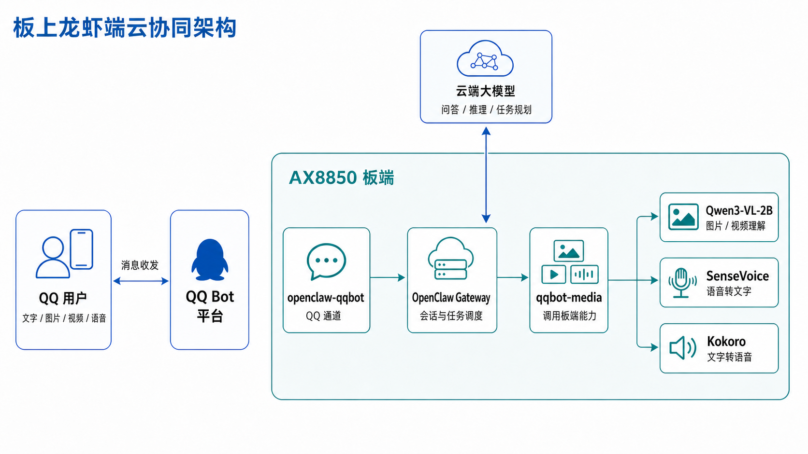

# 板上龙虾端云协同方案（Lobster End-Cloud Collaboration）

## 一、简介

在 AX8850 板上运行 OpenClaw Gateway，再接入 QQ Bot，就可以直接在 QQ 中使用板上的图片、视频和语音能力。OpenClaw 负责接收消息和调用工具，Qwen3-VL-2B、SenseVoice、Kokoro 分别负责看图、听写和语音合成，普通问答和复杂推理则交给已经配置好的云端模型。

实际使用时，板端和云端各自做自己擅长的事：

- 图片和视频由板上的 Qwen3-VL-2B 识别。
- QQ 语音由 SenseVoice 转成文字，需要语音回复时再由 Kokoro 合成。
- OpenClaw 把识别结果和用户的问题交给云端模型，继续完成问答、推理或任务安排。
- 用户只需要打开 QQ，不必另外安装客户端。

## 二、方案架构

### 1. 架构图



### 2. 端云分工

| 组件 | 在哪里运行 | 作用 |
| --- | --- | --- |
| QQ Bot | QQ 平台 | 把用户的文字和媒体消息送到板端，并接收机器人回复 |
| `openclaw-qqbot` | AX8850 板端 | 接收 QQ 消息、下载附件，并负责把回复发回 QQ |
| OpenClaw Gateway | AX8850 板端 | 管理会话，调用模型、工具和 Skill，整理最终回复 |
| `qqbot-media` | OpenClaw 扩展目录 | 按消息类型调用板上的 VLM、ASR、TTS 脚本 |
| Qwen3-VL-2B + AXLLM | AX8850 板端 | 在 `8120` 端口提供 VLM 服务，用来理解图片和视频 |
| SenseVoice + sherpa-onnx | AX8850 板端 | 将 QQ 语音转成文字 |
| Kokoro + sherpa-onnx | AX8850 板端 | 将回复文字合成为语音，再由 QQ Bot 发回用户 |
| 通用大模型 | 云端 | 完成普通问答、复杂推理和任务规划 |

### 3. 图片、视频和语音

| QQ 中发送的内容 | 板上会做什么 | 云端会做什么 | 回复 |
| --- | --- | --- | --- |
| 图片 | `axera_vlm_image.sh` 调用本地 VLM，给出画面描述或文字识别结果 | 结合用户的问题继续回答 | QQ 文字，也可以转成语音 |
| 视频 | `axera_vlm_video.sh` 均匀抽帧后调用本地 VLM，单次最多使用 8 帧 | 根据视频摘要回答问题 | QQ 文字 |
| 语音 | `axera_asr.sh` 将音频转为 16 kHz 单声道 WAV，再用 SenseVoice 转写 | 根据转写内容回答或执行任务 | QQ 文字或语音 |
| 要求语音回复 | `axera_tts.sh` 使用 Kokoro 合成 WAV | 先生成回复文字 | QQ 语音 |

`qqbot-media` 会先把图片、视频或语音交给板上的对应脚本。图片和视频得到文字描述，语音得到转写文本，OpenClaw 再根据这些内容回答用户。

## 三、适用场景

| 使用方式 | 举例 |
| --- | --- |
| 日常助手 | 在手机 QQ 中发送文字、图片、视频或语音，让机器人直接回复 |
| 设备排查 | 拍摄接口、指示灯或报错画面，询问应该先检查哪里 |
| 语音助手 | 用语音提问，或者让机器人把答案读出来 |
| 图片和录音不交给云端模型 | 在板上完成看图和语音转写，只把文字结果交给云端模型 |
| 现场演示 | 用一段 QQ 对话展示 AX8850 的 VLM、ASR、TTS 和 OpenClaw |
| 二次开发 | 更换模型、修改脚本，或继续增加新的工具 |

## 四、部署与启动

下面的命令都在 AX8850 板上执行。本文以 `root` 用户为例，模型和脚本下载到 `/root/openclaw-ax8850-qqbot-media`。

### 1. 准备

开始前需要准备：

- 一台可正常联网和运行 AXLLM 的 AX8850 设备。
- 可用的 `bash`、`python3`、`curl`、`ffmpeg` 和 `ffprobe`。
- 云端模型的 API Key 或相应认证信息，用于 OpenClaw 的通用推理。
- 一个 QQ Bot，或一个可用于扫码创建 QQ Bot 的 QQ 账号。
- 足够的存储空间和 CMM。建议 `/root` 至少保留 10 GiB 可用空间，CMM 大于 2.5 GiB；实际占用以下载的模型版本为准。

先确认下面这些命令可以使用：

```bash
command -v bash
command -v python3
command -v curl
command -v ffmpeg
command -v ffprobe
```

如果某条命令没有输出路径，请先安装对应工具。

### 2. 安装 OpenClaw

使用 OpenClaw 官方安装脚本：

```bash
curl -fsSL https://openclaw.ai/install.sh | bash -s -- --no-onboard
openclaw onboard --install-daemon
```

`onboard` 向导会要求选择模型服务商、填写 API Key，并安装 Gateway 服务。这里配置的模型只负责问答、推理和任务规划，不需要支持图片或语音。

安装完成后检查：

```bash
openclaw --version
openclaw doctor
openclaw gateway status
```

如果板上已经装好 OpenClaw，可以跳过这一步。

### 3. 申请 QQ Bot 并安装插件

打开 [QQ Bot 快速注册页](https://q.qq.com/qqbot/openclaw/login.html)，使用手机 QQ 扫码登录并创建机器人。在机器人页面保存 `AppID` 和 `AppSecret`。绑定时，Token 写成下面这种形式：

```text
AppID:AppSecret
```

在板上安装 QQ Bot 插件：

```bash
openclaw plugins install @tencent-connect/openclaw-qqbot@1.7.1
openclaw plugins list
```

本文使用 `1.7.1`，这个版本带有后面要替换的 `skills/qqbot-media` 目录。2.x 版本已经改过目录结构，不能直接使用下面的复制命令。

安装后检查这个目录：

```text
/root/.openclaw/extensions/openclaw-qqbot/
```

先不用绑定 QQ，等模型和 `qqbot-media` 都放好后再重启 Gateway。

### 4. 下载模型和 `qqbot-media`

先打开 [Hugging Face 文件列表](https://huggingface.co/AXERA-TECH/openclaw-ax8850-qqbot-media/tree/main)，确认能看到 `qqbot-media`、`vlm`、`SenseVoiceSmall-axmodel` 和 `kokoro`。然后安装 Hugging Face CLI 并下载：

```bash
curl -LsSf https://hf.co/cli/install.sh | bash
export PATH="/root/.local/bin:$PATH"

hf download AXERA-TECH/openclaw-ax8850-qqbot-media \
  --local-dir /root/openclaw-ax8850-qqbot-media
```

下载中断时，可以再次执行同一条 `hf download` 命令，已经完成的文件不会重复下载。完成后应看到：

```text
/root/openclaw-ax8850-qqbot-media/
├── qqbot-media/
│   ├── SKILL.md
│   └── scripts/
├── vlm/
│   ├── axllm
│   └── Qwen3-VL-2B-Instruct-GPTQ-Int4/
├── SenseVoiceSmall-axmodel/
└── kokoro/
```

逐项检查几个关键文件：

```bash
test -f /root/openclaw-ax8850-qqbot-media/qqbot-media/SKILL.md &&
  echo "qqbot-media: OK"
test -f /root/openclaw-ax8850-qqbot-media/vlm/Qwen3-VL-2B-Instruct-GPTQ-Int4/config.json &&
  echo "VLM: OK"
test -f /root/openclaw-ax8850-qqbot-media/SenseVoiceSmall-axmodel/ax650/model-10-seconds.axmodel &&
  echo "ASR: OK"
test -f /root/openclaw-ax8850-qqbot-media/kokoro/kokoro-multi-lang-v1_0-axmodel/voices.bin &&
  echo "TTS: OK"
```

再给几个板端程序加上执行权限：

```bash
chmod +x /root/openclaw-ax8850-qqbot-media/vlm/axllm
chmod +x /root/openclaw-ax8850-qqbot-media/SenseVoiceSmall-axmodel/\
sherpa-onnx-*-axera-ax650-linux-aarch64-shared/bin/sherpa-onnx-offline
chmod +x /root/openclaw-ax8850-qqbot-media/SenseVoiceSmall-axmodel/\
sherpa-onnx-*-axera-ax650-linux-aarch64-shared/bin/sherpa-onnx-vad-with-offline-asr
chmod +x /root/openclaw-ax8850-qqbot-media/kokoro/build/bin/sherpa-onnx-offline-tts
```

### 5. 换上板端版 `qqbot-media`

分别确认插件自带的版本和刚下载的版本都存在：

```bash
test -f /root/.openclaw/extensions/openclaw-qqbot/skills/qqbot-media/SKILL.md &&
  echo "原 Skill: OK"
test -f /root/openclaw-ax8850-qqbot-media/qqbot-media/SKILL.md &&
  echo "AX8850 Skill: OK"
```

先备份原目录，再复制 AX8850 版本：

```bash
skill_src=/root/openclaw-ax8850-qqbot-media/qqbot-media
skill_dst=/root/.openclaw/extensions/openclaw-qqbot/skills/qqbot-media
skill_bak="${skill_dst}.bak.$(date +%Y%m%d-%H%M%S)"

mv "$skill_dst" "$skill_bak"
cp -a "$skill_src" "$skill_dst"
chmod +x "$skill_dst"/scripts/*.sh
```

复制完成后，下面这些文件应直接位于 `skills/qqbot-media` 中。如果路径里连续出现两个 `qqbot-media`，说明多复制了一层目录。

```text
/root/.openclaw/extensions/openclaw-qqbot/skills/qqbot-media/SKILL.md
/root/.openclaw/extensions/openclaw-qqbot/skills/qqbot-media/scripts/axera_vlm_image.sh
/root/.openclaw/extensions/openclaw-qqbot/skills/qqbot-media/scripts/axera_vlm_video.sh
/root/.openclaw/extensions/openclaw-qqbot/skills/qqbot-media/scripts/axera_asr.sh
/root/.openclaw/extensions/openclaw-qqbot/skills/qqbot-media/scripts/axera_tts.sh
```

### 6. 启动 AXLLM

要使用图片和视频理解，先打开一个单独的终端启动 AXLLM，并保持该终端运行：

```bash
cd /root/openclaw-ax8850-qqbot-media/vlm
chmod +x ./axllm
./axllm serve ./Qwen3-VL-2B-Instruct-GPTQ-Int4/ --port 8120
```

模型加载完成后会监听 `8120` 端口。另开一个终端检查：

```bash
curl -fsS http://127.0.0.1:8120/health
curl -fsS http://127.0.0.1:8120/v1/models
```

VLM 脚本默认访问 `http://172.17.0.1:8120/v1`，这是 OpenClaw 运行在容器中时使用的地址。OpenClaw 直接运行在板上时，改成 `127.0.0.1`：

```bash
openclaw config set env.vars.AXERA_VLM_BASE "http://127.0.0.1:8120/v1"
openclaw config get env.vars.AXERA_VLM_BASE
```

这个地址写入 OpenClaw 配置后，Gateway 重启也能继续使用。

### 7. 绑定 QQ Bot

把下面的占位内容替换为 QQ 开放平台中的真实 `AppID` 和 `AppSecret`：

```bash
openclaw channels add --channel qqbot --token "<APP_ID>:<APP_SECRET>"
openclaw gateway restart
```

```{warning}
`AppSecret` 是敏感凭据。不要把真实 Token 写进文档、截图、Issue 或公开日志；共享终端记录前也应先检查命令历史。
```

确认通道和 Gateway 状态：

```bash
openclaw channels list
openclaw gateway status
openclaw logs --follow
```

日志中没有持续报错后，即可回到 QQ，找到刚创建的机器人并发送消息。

### 8. 先在命令行试一遍

绑定 QQ 前，或者遇到问题时，可以直接运行下面的脚本。

测试图片理解：

```bash
AXERA_VLM_BASE=http://127.0.0.1:8120/v1 \
bash /root/.openclaw/extensions/openclaw-qqbot/skills/qqbot-media/scripts/axera_vlm_image.sh \
  "/root/openclaw-ax8850-qqbot-media/vlm/Qwen3-VL-2B-Instruct-GPTQ-Int4/image.png" \
  "请用中文客观描述图片中的主体和场景。"
```

测试语音转文字：

```bash
bash /root/.openclaw/extensions/openclaw-qqbot/skills/qqbot-media/scripts/axera_asr.sh \
  "/root/openclaw-ax8850-qqbot-media/SenseVoiceSmall-axmodel/test_wavs/zh.wav"
```

测试文字转语音：

```bash
bash /root/.openclaw/extensions/openclaw-qqbot/skills/qqbot-media/scripts/axera_tts.sh \
  "/tmp/axera_tts_test.wav" \
  "你好，这是一段由 AX8850 在本地生成的测试语音。"

test -s /tmp/axera_tts_test.wav && ls -lh /tmp/axera_tts_test.wav
```

三个脚本都能正常运行后，再回到 QQ 中测试文字、图片、视频和语音。

## 五、使用示例

下面是几种常见用法，实际回复会随图片、视频、问题和云端模型而变化。

### 1. 图片理解：识别设备与可见文字

用户在 QQ 中发送一张设备照片：

> 请看一下这张图，列出能识别到的接口、指示灯状态和可见文字。

QQ Bot 将图片保存到板上，`qqbot-media` 随后调用 `axera_vlm_image.sh`。Qwen3-VL-2B 识别设备、接口、灯光和文字，OpenClaw 再按照用户的问题整理答案。

这种用法适合设备巡检、包装标签识别、截图解读和简单 OCR。

### 2. 视频理解：概括过程与关键动作

用户发送一段短视频：

> 按时间顺序概括这段视频发生了什么，并列出三个关键动作。

`axera_vlm_video.sh` 会均匀抽帧，再通过 AXLLM 分析这些画面。当前脚本一次最多使用 8 帧，适合概括短视频、判断动作顺序和记录现场过程。

对于很长的视频，建议先剪取与问题相关的片段。抽帧理解不能替代逐帧检测，也不适合判断只出现一瞬间的细节。

### 3. 用语音提问

用户在 QQ 中发送语音：

> 请简单解释一下什么是端云协同。

QQ 语音可能是 `.bin`、SILK 或其他移动端格式。`axera_asr.sh` 会先用 FFmpeg 转成 16 kHz 单声道 PCM WAV，再调用 SenseVoice 转成文字，OpenClaw 按照这段文字继续回答。

### 4. 让机器人用语音回复

用户发送文字：

> 请用语音简单介绍 AX8850 板上的图片和语音功能。

OpenClaw 先写好回复，`axera_tts.sh` 再调用 Kokoro 和 sherpa-onnx 合成 WAV，最后由 QQ Bot 把这段语音发回用户。

### 5. 图片和语音一起排查设备问题

用户先拍摄一张设备报错画面，再补充一段语音：

> 设备启动后一直停在这里，指示灯也在闪。可能是什么问题？我应该先检查哪里？

收到这两条消息后：

1. Qwen3-VL-2B 从图片中提取报错文字、设备状态和可见连接信息。
2. SenseVoice 把用户的语音问题转成文字。
3. OpenClaw 把图片识别结果和语音转写结果交给云端模型，生成排查建议。
4. 如果用户要求语音回复，Kokoro 再合成语音并通过 QQ 返回。

## 六、常见问题

| 现象 | 怎么排查 |
| --- | --- |
| `openclaw` 命令不存在 | 重新检查官方安装输出和当前用户的 `PATH`，再执行 `openclaw --version` |
| 找不到 `openclaw-qqbot` 扩展目录 | 先执行 `openclaw plugins list`，确认 `@tencent-connect/openclaw-qqbot` 已安装成功 |
| 下载后没有 VLM、SenseVoice 或 Kokoro | 先看 Hugging Face 文件列表中是否已经有这些目录；如果下载中断，重新执行相同的 `hf download` 命令 |
| 执行 `./axllm` 提示 `Permission denied` | 在 `vlm` 目录执行 `chmod +x ./axllm` |
| `8120` 健康检查失败 | 确认 AXLLM 终端仍在运行、模型已经加载完成，并检查端口是否被其他进程占用 |
| QQ 能收到图片，但机器人无法理解 | 先执行本文的图片脚本测试；再确认 Gateway 所在环境能访问 `AXERA_VLM_BASE` 指向的地址 |
| ASR 失败 | 检查 `ffmpeg`、`ffprobe`、`SenseVoiceSmall-axmodel` 和 sherpa-onnx 运行库是否完整 |
| TTS 失败 | 检查 `kokoro` 模型目录、sherpa-onnx 可执行文件及动态库是否完整 |
| 视频出现 KV Cache 或输入长度错误 | 保持单次帧数不超过 8；可降低 `AXERA_VIDEO_FRAMES`，或增大 `AXERA_VIDEO_STRIDE` 做更稀疏的采样 |
| QQ Bot 不回复 | 确认 Token 使用 `AppID:AppSecret` 格式，执行 `openclaw channels list`，并通过 `openclaw logs --follow` 查看通道错误 |
| 更新 QQ Bot 插件后图片或语音功能失效 | 插件更新可能恢复自带的 `qqbot-media`，重新核对 Skill 目录并按本文步骤替换，然后重启 Gateway |
| 退出 SSH 后 Gateway 随之停止 | 检查 systemd 用户服务和 lingering 状态；必要时执行 `loginctl enable-linger root`，再重启 Gateway |

脚本默认到 `/root/openclaw-ax8850-qqbot-media` 查找 ASR 和 TTS 文件。如果把它们放到其他位置，需要修改下面两个配置：

```bash
openclaw config set env.vars.AXERA_MEDIA_ROOT "<下载目录>"
openclaw config set env.vars.AXERA_KOKORO_ROOT "<下载目录>/kokoro"
openclaw gateway restart
```

## 七、相关链接

- [OpenClaw 官方安装文档](https://docs.openclaw.ai/install)
- [OpenClaw 源码仓库](https://github.com/openclaw/openclaw)
- [腾讯 QQ Bot OpenClaw 插件 v1.7.1](https://github.com/tencent-connect/openclaw-qqbot/tree/v1.7.1)
- [QQ 开放平台](https://q.qq.com/)
- [AX8850 OpenClaw QQBot 媒体资源](https://huggingface.co/AXERA-TECH/openclaw-ax8850-qqbot-media)
- [AXERA-TECH/ax-llm](https://github.com/AXERA-TECH/ax-llm)
- [AX8850 端云协同参考文章](https://zhuanlan.zhihu.com/p/2031381918990734047)
- [AX8850 板端 ASR、TTS 使用说明](https://zhuanlan.zhihu.com/p/2036543299289346711)
