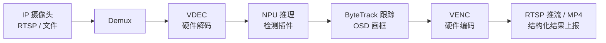

# AIBOX 通用方案

## 一、简介

AIBOX（边缘 AI 盒子）是多路视频流分析场景中最常见的产品形态之一：一台小型边缘设备接入多路 IP 摄像头，在本地完成**拉流、硬件解码、NPU 推理、目标跟踪、OSD 叠加、编码转发**的完整链路，再把带框视频流或结构化结果交给上层业务平台。

基于 AXERA 芯片构建 AIBOX 具备以下优势：

- **多路并发**：AX650 / AX8850 系列提供高密度视频解码与 NPU 算力，单芯片即可承载多路视频的解码 + 检测 + 编码；AX620E 系列（AX630C / AX620Q）可覆盖 1~2 路 1080p 的轻量场景。
- **形态灵活**：既支持板端 SoC 方案（MSP SDK），也支持以 AXCL PCIe 算力卡形式插入 x86_64 / aarch64 主机，把存量服务器、工控机升级为 AI 盒子。
- **全硬件加速**：解码（VDEC）、图像处理（IVPS）、推理（NPU）、编码（VENC）全部由专用硬件承接，CPU 只负责业务调度。
- **软件开箱即用**：官方开源中间件 AX-Video SDK + AX-Pipeline 已把整条链路封装好，通过 JSON 配置即可跑起多路端到端 pipeline，算法以插件形式接入。

单路典型链路如下（多路 pipeline 并行运行）：

## 二、方案组成

方案的软件底座是两个开源流媒体中间件，详细介绍见 [高效开发中间件](../../06_samples/middleware.md) 章节：

| 组件 | 角色 | 仓库 |
| --- | --- | --- |
| **AX-Video SDK** | 视频能力封装库：编解码、JPEG、图像处理（crop / resize / csc）、Pipeline（demux / mux / OSD），隔离 AX650 与 AX620E 系列差异，以单个动态库 `libax_video_sdk.so` 交付 | <https://github.com/AXERA-TECH/ax-video-sdk> |
| **AX-Pipeline** | 基于 AX-Video SDK 的多路端到端 AI 流水线运行器：`demux → decode → (npu + osd + tracking) → N × (encode → mux)`，JSON 配置驱动，支持 HTTP API 动态编排 | <https://github.com/AXERA-TECH/ax-pipeline> |

基于 AX-Pipeline 搭建 AIBOX 时，业务侧通常只需要做两件事：

1. **写配置**：在 JSON 中声明每路 pipeline 的输入流地址、模型插件、推理限速（`npu_max_fps`）、跟踪与输出方式（参考 `configs/example.json`），也可通过 HTTP API 在运行时动态增删 pipeline。
2. **接算法**：检测 / 分类等模型以 C ABI 插件（`.so`）形式接入，内置 YOLOv5 / YOLOv8 / Helmet 等参考插件；支持 `inproc`（低延迟）与 `process`（崩溃隔离）两种运行模式，并可在插件内复用 ByteTrack 搭建「检测 → 跟踪 → 分类」多级模型链路。

## 三、适用场景

| 场景 | 典型需求 | 方案收益 |
| --- | --- | --- |
| 视频流分析盒子 / 边缘 AI 网关 | 接入既有 IP 摄像头，本地完成检测告警，输出带框视频与结构化事件 | 多路硬解 + NPU 插件化推理，免自研流媒体底座 |
| 存量 NVR / 服务器智能化改造 | 不更换整机，为 x86 / ARM 主机补充 AI 分析能力 | AXCL 算力卡与板端共用同一套 AX-Pipeline 软件栈，支持单进程多卡 |
| 行业算法快速落地 | 自研模型接入真实多路视频流，验证端侧表现 | 算法只需实现插件接口，取流、编排、跟踪、OSD 均由中间件提供 |
